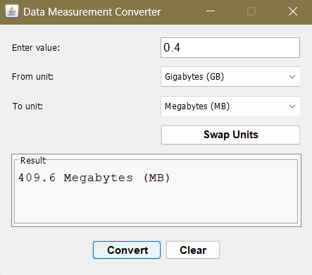

# Data Measurement Converter

A Java Swing-based desktop application for converting between different data measurement units. This calculator provides a simple, intuitive interface for quick and accurate data unit conversions using the JEDEC standard (binary-based conversions).

## Features

- **Comprehensive Unit Support:** Convert between Bits, Bytes, Kilobytes, Megabytes, Gigabytes, Terabytes, and Petabytes
- **JEDEC Standard Compliance:** Uses binary conversions (1 KB = 1024 Bytes, 1 MB = 1024 KB, etc.) as per computing industry standards
- **Intelligent Number Formatting:** Automatically switches between standard and scientific notation for very large or very small numbers
- **Bidirectional Conversion:** Easily swap between source and target units with the click of a button
- **Real-time Validation:** Comprehensive input validation with clear error messages
- **Keyboard Support:** Press Enter to perform conversions quickly
- **Clean Interface:** Simple, focused design that gets the job done without clutter

## Supported Units

- Bits (b)
- Bytes (B)
- Kilobytes (KB) - 1024 Bytes
- Megabytes (MB) - 1024 Kilobytes
- Gigabytes (GB) - 1024 Megabytes
- Terabytes (TB) - 1024 Gigabytes
- Petabytes (PB) - 1024 Terabytes

## Example Usage

### Interactive Input/Output

### Basic Conversion Example

- Input: 0.4
- From: Gigabytes (GB)
- To: Megabytes (MB)
- Output: 409.6 Megabytes (MB)

### Using the Swap Feature

- Enter your value and select units
- Click "Convert" to see the result
- Click "Swap Units" to instantly reverse the conversion direction
- The conversion automatically recalculates with the swapped units

## How to Build and Run

### Prerequisites

- Java JDK 8 or later
- Basic Java development environment

### Compilation and Execution

- Compile the application
1. javac DataConverter.java

- Run the application
2. java DataConverter

### For Development

The application consists of a single self-contained Java file. You can import it into your favorite Java IDE or compile and run from the command line as shown above.

## Technical Details

- **Framework:** Java Swing for GUI components
- **Conversion Standard:** JEDEC (binary) - all conversions use powers of 1024
- **Number Formatting:** Automatic selection between standard and scientific notation based on value magnitude
- **Error Handling:** Comprehensive validation for empty inputs, negative numbers, invalid formats, and same-unit selections
- **Layout:** Grid-based layout with consistent spacing and intuitive component arrangement

## License

This project is open source and available under the MIT License.